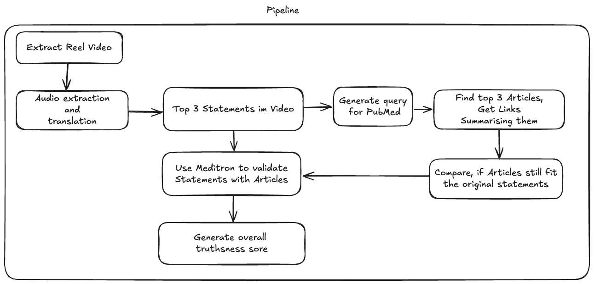

# Reel‑Fact‑Checker

**Automatically transcribe Instagram Reels, extract factual claims, search for supporting evidence, and return a scored truthfulness report — all from a single POST request.**

---

## ✨ Features

| Stage                         | What it does                                                   | Key deps                            |
| ----------------------------- | -------------------------------------------------------------- | ----------------------------------- |
| 1. **Download**               | Grabs the Reel video & metadata via *Instaloader*              | `instaloader`                       |
| 2. **Audio extraction**       | Converts MP4 → WAV                                             | `moviepy`, `ffmpeg-python`          |
| 3. **Transcription**          | Generates an accurate transcript with Whisper                  | `openai-whisper`, `torch`, `ffmpeg` |
| 4. **Statement slicing**      | Breaks the transcript into discrete factual claims             | `llama‑cpp‑python`                  |
| 5. **Query generation**       | Produces web‑search queries tailored to each claim             | LLaMA‑powered prompt                |
| 6. **Web retrieval**          | Fetches candidate articles & videos                            | `requests`, (any search API)        |
| 7. **Evidence summarisation** | Distils retrieved content down to the relevant passages        | LLaMA prompt                        |
| 8. **Truthfulness scoring**   | Judges each claim *True / False / Mixed* & assigns a 0‑1 score | LLaMA prompt                        |

> All steps live in \`\` files so you can run them independently or as a full pipeline.

---

## 🗂️ Repository layout

```
├── app/                  # Core source
│   ├── main.py           # FastAPI entry‑point
│   ├── pipeline.py       # Orchestrates the eight steps
│   ├── reel_utils.py     # Helpers for download & media handling
│   ├── step_1_audio_to_transcript.py
│   ├── … step_8_statement_to_score.py
│   ├── *.wav             # Test fixtures
│   └── json_example.json # Sample output
├── reel‑to‑wav/          # One‑off converter script
├── archive_old_tests/    # Experimental notebooks & tests
├── requirements.txt      # Python deps
└── README.md             # ← you are here
```

---

## 🚀 Quick start

### 1. Prerequisites

* **Python ≥ 3.9** (tested on 3.11)
* **FFmpeg** in your `$PATH`
* **Ollama** running locally with a LLaMA‑3/8B (or bigger) model pulled
* A **GPU** (optional but 🏎️ fast) — Whisper & LLaMA both detect CUDA automatically

```bash
# Ubuntu example
sudo apt update && sudo apt install ffmpeg git
curl -fsSL https://ollama.ai/install.sh | sh  # installs & launches the Ollama daemon
ollama pull llama3:8b                         # download a model once
```

### 2. Install Python deps

```bash
git clone https://github.com/your‑org/reel‑fact‑checker.git
cd reel‑fact‑checker
python -m venv .venv
source .venv/bin/activate
pip install -r requirements.txt
```

### 3. Run the API

```bash
# inside the repo root
uvicorn app.main:app --host 0.0.0.0 --port 8000 --reload
```

Now open [http://localhost:8000/docs](http://localhost:8000/docs) to explore the interactive OpenAPI docs.

---

## 🖇️ Example request

```bash
curl -X POST http://localhost:8000/process \
  -H "Content-Type: application/json" \
  -d '{
        "url": "https://www.instagram.com/reel/DJE5V6_RHvu/",
        "mock": false
      }'
```

```jsonc
{
  "id": "12c5c52f‑4ad3‑45da‑8b31‑e24996c0a293",
  "transcript": "…full transcript…",
  "statements": [
    {
      "text": "The Eiffel Tower grows up to 15 cm during summer.",
      "truthness": "true",
      "score": 0.94,
      "evidence": [
        "https://www.bbc.com/news/world‑europe‑…",
        "https://en.wikipedia.org/wiki/Eiffel_Tower"
      ],
      "summary": "Thermal expansion of the iron causes a measurable height increase of ~15 cm on hot days."
    },
    …
  ]
}
```

Set `"mock": true` to skip the network calls and return the **sample output** in `app/json_example.json` — perfect for local UI prototyping.

---

## ⚙️ Environment variables

| Name              | Default                  | Purpose                            |
| ----------------- | ------------------------ | ---------------------------------- |
| `OLLAMA_BASE_URL` | `http://localhost:11434` | Where to reach the Ollama REST API |
| `LLAMA_MODEL`     | `llama3:8b`              | Model tag to use for all prompts   |
| `MAX_TOKENS`      | `2048`                   | Cap for generation length          |

> Add a `.env` file or export vars in your shell. `pipeline.py` reads them with `os.getenv()`.

---

## 🛠️ Developing & testing

1. **Run a single step** for debugging:

   ```bash
   python -m app.step_3_statement_to_query app/json_example.json
   ```
2. **Unit tests** live next to their subject files. Execute everything with:

   ```bash
   pytest -q
   ```
3. **Black + ruff** keep the code tidy:

   ```bash
   ruff check . && black --check .
   ```

---

## 🗺️ Pipeline diagram


## 🗺️ Pipeline diagram




---

## 📦 Docker (optional)

A minimal production image is provided. Build & run:

```bash
docker build -t reel‑fact‑checker .
docker run -p 8000:8000 -e OLLAMA_BASE_URL=http://host.docker.internal:11434 reel‑fact‑checker
```

The container bundles Whisper’s English model and your requirements, but you’ll still need an Ollama server (or any LLM endpoint) reachable from the host.

---

## 📝 License

Distributed under the **MIT License** — see `LICENSE` for details.

---

## 🤝 Contributing

Pull requests are very welcome! For major changes, please open an issue first to discuss what you would like to change.

1. Fork ▶️ branch ▶️ commit (+ tests) ▶️ PR.
2. Make sure `ruff` & `black` pass.
3. One feature per PR.

---

## 🙏 Acknowledgements

* [OpenAI Whisper](https://github.com/openai/whisper)
* [LLaMA‑cpp](https://github.com/ggerganov/llama.cpp)
* [Instaloader](https://instaloader.github.io/)
* [MoviePy](https://zulko.github.io/moviepy/)
* And every OSS maintainer who made this pipeline possible ♥️
